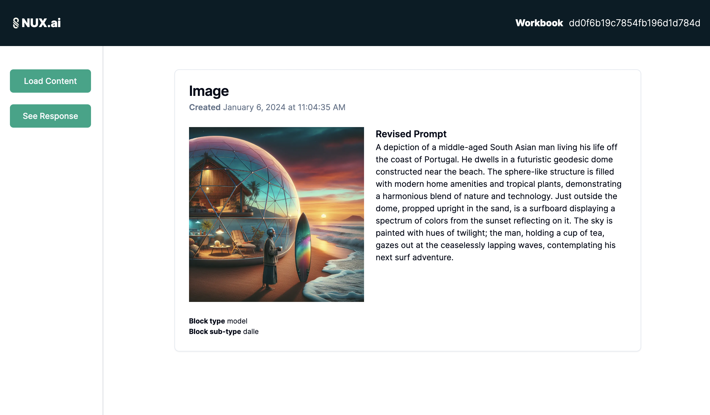
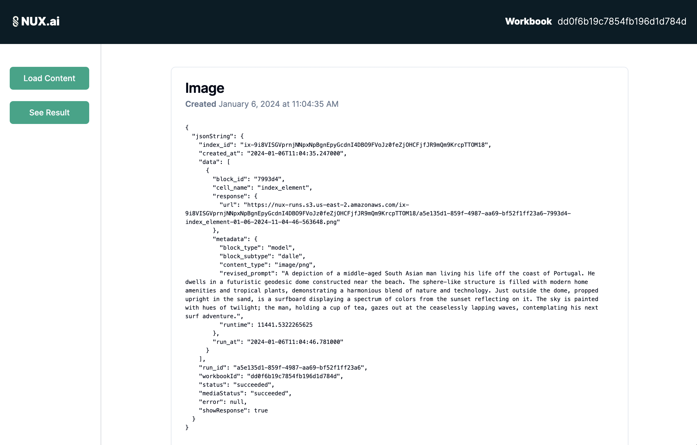
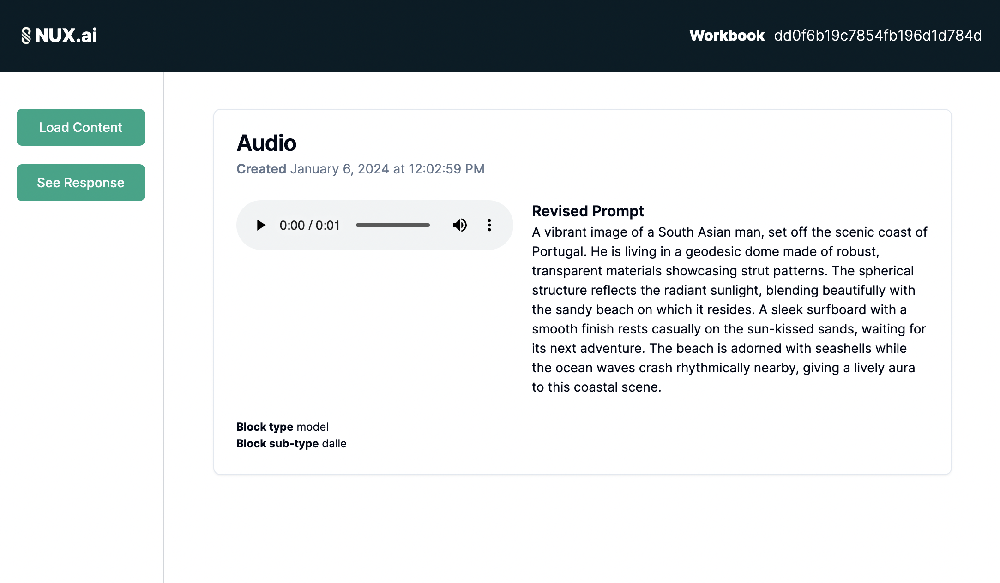
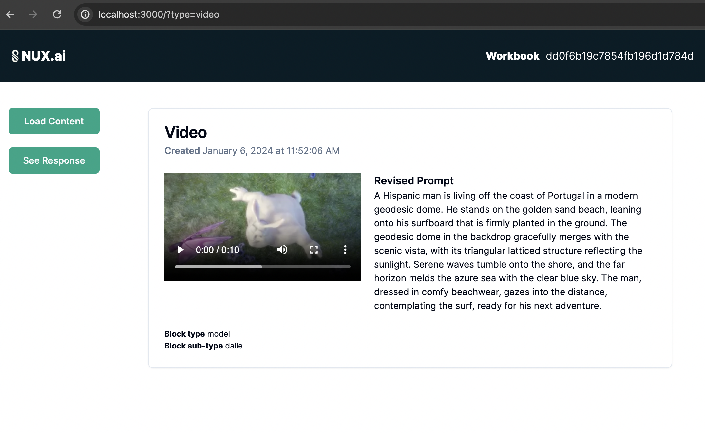
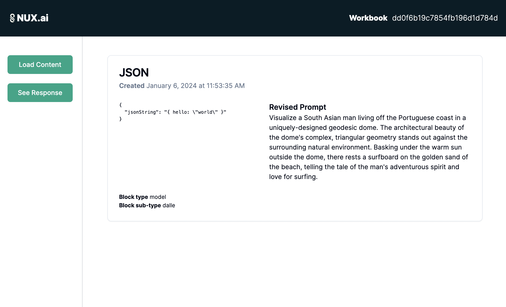

# Dynamic Content Rendering
Once setup and running locally the user should be able to click the `Load content` button in the sidebar and retrieve a "block" result in the dashboard based on a hardcoded workbookId `dd0f6b19c7854fb196d1d784d`. Additionally, the user can toggle via a newly arisen button (after the content is generated) to toggle between viewing the result or the api response in a shadcd `Card` component.

#### Content Loaded



#### API Response



## Setup

### Install Dependencies
```bash
cd content-renderer
yarn install
```

### Environment Variables 
You'l need a `.env` file with one variable

```bash
API_BEARER_TOKEN=xxxx
```

### Run locally
```bash
yarn dev
```

### Test locally
```bash
yarn test
#or
yarn test:watch
```

## Visit
To use the app visit `http://localhost:3000`

### Loading Non-Image Results

I've implemented some logic to use url parameters to generate hardcoded audio, video, and json results.

You can verify DOM output by adding any of these to the url. Omitting this `type` param will yield the `image/png` result returned from the API. All metadata/etc for these hardcoded results will still come from the result of the API request that is still made. The code merely replaces what's presented in the DOM according to `content-type` as requested.


```bash
?type=audio
#
?type=video
# or
?type=json
```

#### Audio




#### Video




#### JSON


